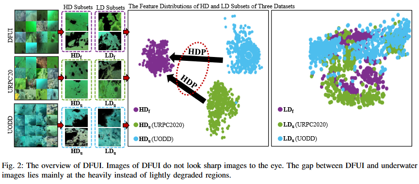

# Learning Heavily Degraed Piror

This repo is the official implementation of [Learning Heavily-Degraded Prior for Underwater Object Detection](https://ieeexplore.ieee.org/document/10113328). It is base on [mmdetection](https://github.com/open-mmlab/mmdetection).

## Introduction

We propose a residual feature transference module (RFTM) to learn a mapping between deep representations of the heavily degraded patches of DFUI and underwater images, and make the mapping as a heavily degraded prior (HDP) for underwater detection. Since the statistical properties are independent to image content, HDP can be learned without the supervision of semantic labels and plugged into popular CNN-based feature extraction networks to improve their performance on underwater object detection. Without bells and whistles, evaluations on URPC2020 and UODD show that our methods outperform CNN-based detectors by a large margin. Our method with higher speeds and less parameters still performs better than transformer-based detectors.



## Dataset and Training strategy

### The DFUI dataset

For the training set of URPC2020 and URPC2021, we use Cascade RCNN to pick up images with $AP \geq 60$ to constrauct DFUI datasets. The DFUI dataset is used for pretraining and unsupervised trainsference training phase in this work.

**Notes**:

- The DFUI dataset can be downloaded from: [DFUI](https://github.com/xiaoDetection/Learning-Heavily-Degraed-Prior/releases/download/datasets/dfui.zip)
- The URPC2020 dataset can be downloaded from: [URPC](https://github.com/xiaoDetection/Learning-Heavily-Degraed-Prior/releases/download/datasets/urpc2020.zip)

### $HD$ and $LD$ subsets

The patches with the transmission value $t$ less than a threshold $T$ ($T$ = 0.5 as a example) from the DFUI and underwater dataset produce the heavily-degraded($HD$) subsets; those having higher transmission values constitute the respective lightly degraded($LD$) subsets. $t$ value can be easily estimated by common UDCP methods.

We only use $HD$ subsets for training. $HD_u$ and $HD_f$ represent subsets of underwater datasets and the DFUI, respectively.

### Two-stage training strategy

For efficiently plugging RFTM into a detector, we propose a two-stage learning scheme from the perspective of the unsupervised and finetune learning strategy. The first stage is training RFTM in an unsupervised manner on $HD_f$ and $HD_u$ subsets without semantic labels. The second stage is fixed RFTM to finetune some components of a detector on underwater dataset.

Please refer to our [paper](https://ieeexplore.ieee.org/document/10113328) for more details.

## Results and Models

### URPC2020

| Methods   | Backbone    | Pretrain                                                                                                                                         | $AP$ | $AP_{50}$ | $AP_{75}$ | $AP_S$ | $AP_M$ | $AP_L$ | #params | config                                                                                                     | model                                                                                                                            |
| --------- | ----------- | ------------------------------------------------------------------------------------------------------------------------------------------------ | ------ | ----------- | ----------- | -------- | -------- | -------- | ------- | ---------------------------------------------------------------------------------------------------------- | -------------------------------------------------------------------------------------------------------------------------------- |
| RFTM-50   | ResNet50    | [cascade_rcnn_r50_dfui](https://github.com/xiaoDetection/Learning-Heavily-Degraed-Prior/releases/download/first_commit/cascade_rcnn_r50_dfui.pth)   | 48.2   | 80.7        | 50.0        | 19.5     | 41.6     | 53.1     | 75.5M   | [config](https://github.com/xiaoDetection/Learning-Heavily-Degraed-Prior/blob/main/configs/rftm/rftm_50.py)   | [rftm_50_urpc](https://github.com/xiaoDetection/Learning-Heavily-Degraed-Prior/releases/download/first_commit/rftm_50_urpc.pth)     |
| RFTM-x101 | ResNetXT101 | [cascade_rcnn_x101_dfui](https://github.com/xiaoDetection/Learning-Heavily-Degraed-Prior/releases/download/first_commit/cascade_rcnn_x101_dfui.pth) | 50.9   | 84.7        | 55.2        | 25.5     | 45.1     | 56.9     | 133.4M  | [config](https://github.com/xiaoDetection/Learning-Heavily-Degraed-Prior/blob/main/configs/rftm/rftm_x101.py) | [rftm_x101_urpc](https://github.com/xiaoDetection/Learning-Heavily-Degraed-Prior/releases/download/first_commit/rftm_x101_urpc.pth) |

### UODD

| Methods   | Backbone    | Pretrain                                                                                                                                         | $AP$ | $AP_{50}$ | $AP_{75}$ | $AP_S$ | $AP_M$ | $AP_L$ | #parames | config                                                                                                     | model                                                                                                                            |
| --------- | ----------- | ------------------------------------------------------------------------------------------------------------------------------------------------ | ------ | ----------- | ----------- | -------- | -------- | -------- | -------- | ---------------------------------------------------------------------------------------------------------- | -------------------------------------------------------------------------------------------------------------------------------- |
| RFTM-50   | ResNet50    | [cascade_rcnn_r50_dfui](https://github.com/xiaoDetection/Learning-Heavily-Degraed-Prior/releases/download/first_commit/cascade_rcnn_r50_dfui.pth)   | 50.8   | 89.0        | 53.6        | 33.6     | 50.9     | 62.8     | 75.5M    | [config](https://github.com/xiaoDetection/Learning-Heavily-Degraed-Prior/blob/main/configs/rftm/rftm_50.py)   | [rftm_50_uodd](https://github.com/xiaoDetection/Learning-Heavily-Degraed-Prior/releases/download/first_commit/rftm_50_uodd.pth)     |
| RFTM-x101 | ResNetXT101 | [cascade_rcnn_x101_dfui](https://github.com/xiaoDetection/Learning-Heavily-Degraed-Prior/releases/download/first_commit/cascade_rcnn_x101_dfui.pth) | 52.7   | 90.8        | 50.0        | 47.7     | 52.4     | 63.5     | 133.4M   | [config](https://github.com/xiaoDetection/Learning-Heavily-Degraed-Prior/blob/main/configs/rftm/rftm_x101.py) | [rftm_x101_uodd](https://github.com/xiaoDetection/Learning-Heavily-Degraed-Prior/releases/download/first_commit/rftm_x101_uodd.pth) |

## Usage

### Installation

To install pytorch, run:

```
conda install pytorch==1.11.0 torchvision==0.12.0 torchaudio==0.11.0 cudatoolkit=11.3 -c pytorch
```

To install mmdetection, run:

```
# install mmcv-full
pip install mmcv-full==1.4.8 -f https://download.openmmlab.com/mmcv/dist/cu113/torch1.11/index.html

# install mmdet
pip install -r requirements/build.txt
python setup.py develop
```

To install guided-filter-pytorch, run:

```
pip install guided-filter-pytorch
```

### Inference

```
python tools/test.py <config_file> <checkpoint_file> --eval bbox
```

### Training

To train RFTM-50, run:

```
python tools/train.py configs/rftm/rftm_50.py --work-dir <work_dir>
```

To train RFTM-X101, run:

```
python tools/train.py configs/rftm/rftm_x101.py --work-dir <work_dir>
```

## Citing

```
@article{Fu2022,
    title = {{Learning Heavily-Degraded Prior for Underwater Object Detection}},
    author = {{Fu, Chenping and Fan, Xin and Xiao, Jiewen and Yuan, Wanqi and Liu, Risheng and Luo, Zhongxuan}},
    journal = {{IEEE TCSVT}}
}
```
